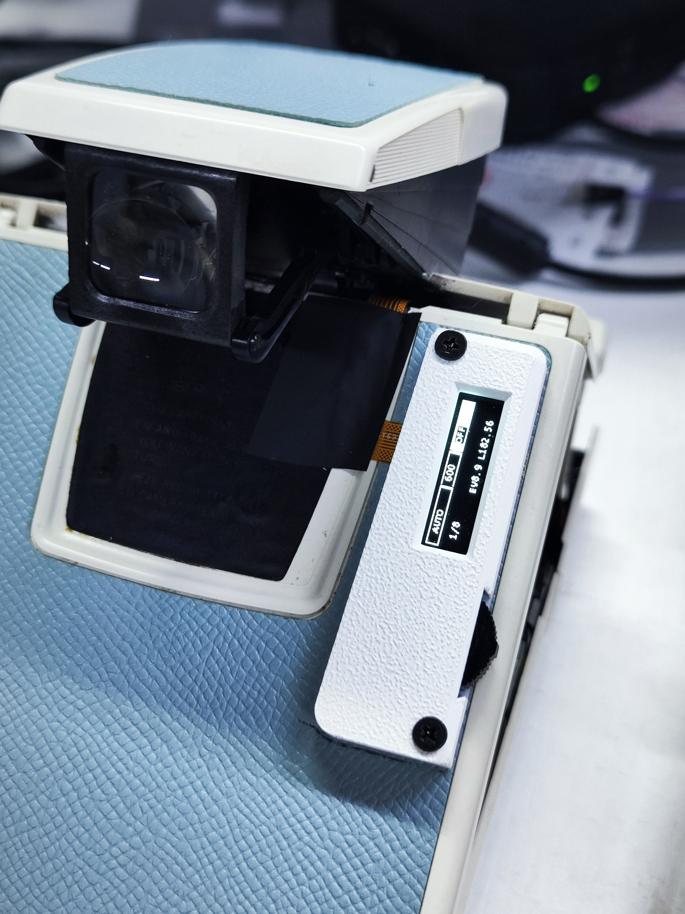
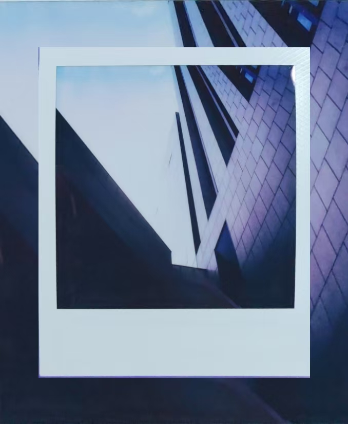

# SX-70z

## 介绍


### 项目组成
项目中包含几个部分的硬件：

1. [相机主控板](Hardware/MainController)：替换相机机头内原装的控制器，接管相机的控制。
2. [机身控制器](Hardware/Body_controller)：显示当前相机工作状态并提供用于交互的按键。粘贴在机身背部，不会增加相机高度，因此大部分相机包依旧可以通用，与相机主控板连接需要 Fpc 排线。

### 开发

PCB部分除FPC使用嘉立创EDA外均使用KiCad9绘制，仓库提供了相应的工程和光绘(gerber)文件。

机身控制器采用ESP-IDF进行开发

## 性能参数
相机主控可以单独使用，此时可以进行自动测光和曝光，如果需要使用B、T以及手动模式需要配备机身控制器。

**快门速度：** 3s-1/8000s，共 27 档，支持 B 门及 T 门 \
**自拍定时：** 0s/2s/5s/10s （倒计时完成后按当前模式自动曝光，倒计时期间挂起其余 Core 1 任务，不受按键干扰）\
**测光：** 支持 ISO 640 相纸（通过 OPT4001 环境光传感器 + 窗口衰减系数 `METERING_ATTEN_K` 标定），实测与 **Sekonic L-308S** 测光表对比，全快门速度范围（3s – 1/8000s）精度一致，自动测光下最低快门速度 3s  \
**闪光同步：** 插入闪光灯后快门速度自动锁定 1/30s，手动模式可设置慢于 1/30s 进行填充闪光

*SX70的光圈在使用闪光灯时将会根据对焦距离进行收缩，此时调整黑白轮可以控制其光圈大小。本项目依旧保留了该特点，因此在使用闪光灯时请注意对焦距离以及黑白轮的位置*

### 曝光模式 × 闪光灯 行为矩阵

| 模式 | 无闪光灯 | 有闪光灯 |
|------|---------|---------|
| **AUTO** | 测光 → 自动选快门速度 → 普通曝光 | 快门固定 1/30s → 闪光曝光（47ms 预延迟后触发电容引闪） |
| **BULB** | 开快门 → 等 S1T 释放 → 关快门 | SOL2 光圈打开 → 开快门 → 47ms → 闪光 → 等 S1T 释放 |
| **TIME** | 开快门 → 等 S1T 按两次 → 关快门 | SOL2 光圈打开 → 开快门 → 47ms → 闪光 → 等 S1T 按两次 |
| **MANUAL** | 用户指定快门速度 → 普通曝光 | 快门限制在 1/30s，按用户速度计算 gap → 闪光曝光 |

所有模式下，相机任务均运行在 **ESP32 的 Core 1**，按优先级分层隔离，曝光时序不受 WiFi/BLE 干扰。

### 软件架构

```
Core 0:   WiFi 协议栈 + NimBLE BLE + HTTP Server (OTA Web) + 事件回调
Core 1:   相机控制（与射频中断隔离）
  ├─ Shutter  Task  prio 10 — 强时序引脚控制（busy-wait，独占 Core 1）
  ├─ Control  Task  prio 8  — 主控逻辑（按键/模式/S1 快门）
  ├─ Display  Task  prio 5  — SSD1306 I2C 刷屏（200ms 周期）
  └─ Metering Task  prio 3  — OPT4001 测光（1s 周期）
```

模块文件：

| 文件 | 职责 |
|------|------|
| `camera_main.c` | 任务调度、曝光时序、电磁铁/电机控制 |
| `gpio_inputs.c` | GPIO 输入处理：S1/S2 去抖、3D 按键、菜单/模式切换 |
| `display_manager.c` | OLED 帧绘制与倒计时显示 |
| `opt4001.c` | OPT4001 环境光传感器 I2C 驱动 |
| `ssd1306.c` | SSD1306 OLED I2C 驱动（esp_lcd 后端） |
| `pcf8575.c` | PCF8575 I2C GPIO 扩展驱动 |
| `pin_init.c` | GPIO 引脚初始化 |
| `ota_web.c` | WiFi HTTP OTA 网页升级 |

## 样片





## 硬件制造
光绘（Gerber）文件可以在 [Hardware](Hardware/) 目录下各子目录中找到，必须使用 0.8mm 以下的 PCB 制造。需要使用 fpc 软排线连接主板和机身控制器。

## 软件

在将机身主控安装至机器内部之前需要将固件通过串口烧录至控制器中。后续可以通过 OTA 无线升级，无需拆机。

**首次 WiFi 配网：**

首次开机相机没有 WiFi 凭据，会通过 BLE 广播 `SX70z_POP`。手机下载 **ESP BLE Provisioning** 应用（iOS/Android 应用商店均有），打开后选择配网，输入配对密钥 `sx70z123`，选择家中 WiFi 并输入密码即可。配网成功后凭据会存入 NVS，下次开机自动连接。

**OTA 升级方式：**
1. 相机开机连接 WiFi（通过 BLE 配网或已保存的凭据自动连接）
2. 手机或电脑连接同一局域网，浏览器打开 `http://SX70z` 或相机 IP
3. 选择编译好的 `.bin` 固件文件上传
4. 上传完成自动重启，新固件生效（Bootloader 会校验固件有效性，异常自动回滚）

建议针对自己的快门适当调整代码中 `shutter_times_x10[]` 的值，可以使用这个[快门速度测试器](https://github.com/ZeshuLiu/ShutterSpeedCalibrator)来测试机器的快门速度，便于调整。

## 组装
> 提示：组装需要一些基本的工具：电烙铁、撬棒和镊子。 \
大多数sx70相机的螺丝都是非常特殊的1mm x 1mm 宝丽来螺丝，拆卸需要特殊的螺丝刀，可以从咸鱼买一把或者自己磨一个。 \
在操作之前推荐先浏览以下内容[Disassembly Guide](https://instantphotography.files.wordpress.com/2010/12/polaroid-sx-70-camera-repair-book.pdf) 或者 [SX70 camera 125ASA to 600ASA conversion](https://opensx70.com/tutorials/100-600-conversion/).

拆卸后对原本主板进行替换即可，如需要机身控制器则将左上角焊盘焊线引出即可通过转接板连接机身控制器。焊接FPC时建议使用含铅(低温)焊锡，否则有损伤机器FPC的风险。只需要将原本的拆掉并且替换上去即可，对于有焊接及机身拆装经验的人来说难度不高。


### 相关开源软件

1. 项目受到了[OPSX ](https://github.com/sunyitong/OPSX)和[openSX70](https://github.com/openSX70)的启发。

